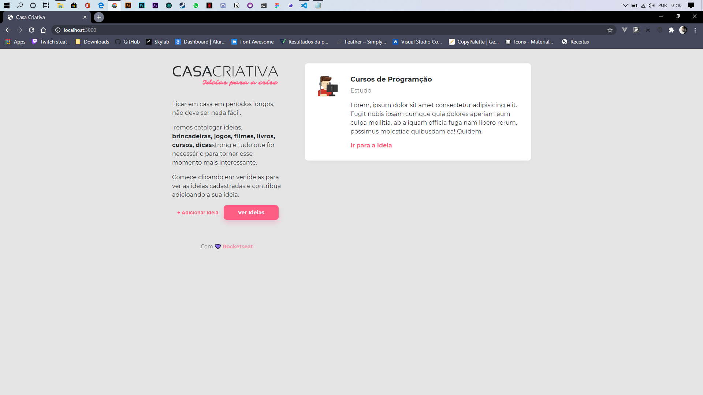
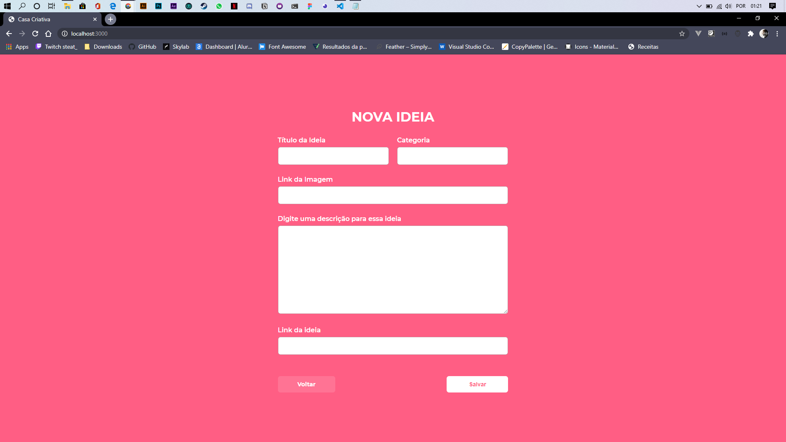

<h1 align="center">
  
</h1>

<h3 align="center">
  Projeto desenvolvido durante o WorkshopDeV Especial da Rocketseat.
</h3>

## :rocket: Tecnologias
<h3>
  Front-end
</h3>

<ul>
  <li>  <strong> HTML5 </strong> </li>
  <li>  <strong> CSS3 </strong> </li>
  <li>  <strong> JavaScript </strong> </li>
</ul>

<h3>
  Back-end
</h3>

<ul>
  <li>  <strong> Node.js </strong> </li>
  <li>  <strong> SQLite 3 </strong> </li>
</ul>

<h3>
  Dependências
</h3>

<ul>
  <li> <strong> Express </strong> </li>
  <li> <strong> Nodemon </strong> </li>
  <li> <strong> Nunjucks </strong> </li>
  <li> <strong> Sqlite3 </strong> </li>
</ul>

## :zap: Executando o projeto

Clone o repositório e execute o comando ```npm install```  para instalar as dependências.

Execute a linha de comando ```npm run dev``` para executar o projeto

No seu navagador, acesse  **localhost:3000**

## :crystal_ball: Telas




---

## :memo: Licença

Esse projeto está sob a licença MIT. Veja o arquivo [LICENSE](/LICENSE) para mais detalhes.

Feito com :purple_heart: by [Rocketseat](https://rocketseat.com.br) and me :space_invader: [e-borhis](https://github.com/e-borhis)
